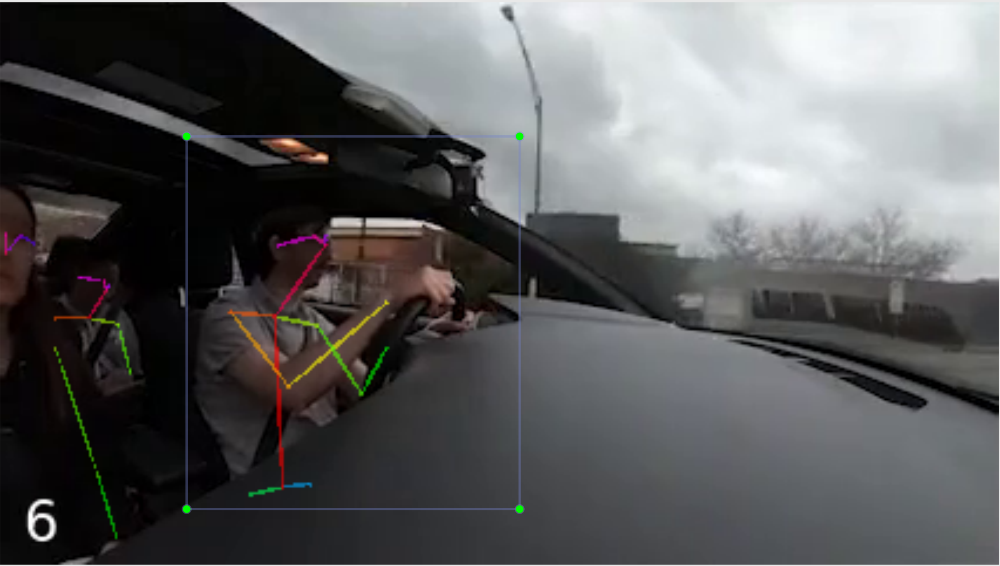
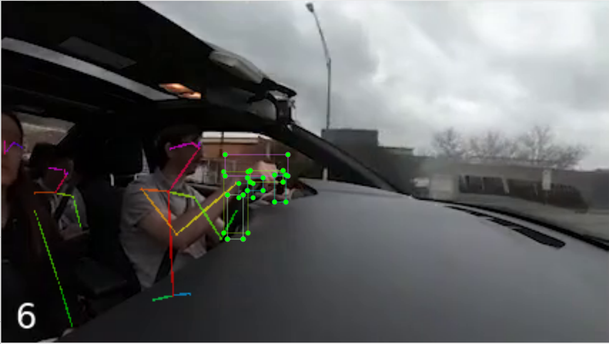

# Pose Detection

This repo contains code to perform pose detection on video clips. This was created as part of an ongoing research project at Carnegie Mellon Human-Computer Interaction Institute under Dr. Nik Martelaro. The project is aimed at assisting user researchers in analyzing large amounts of qualitative data that humans are typically tasked with. Specifically, my role was concerned with developing and using off-the-shelf machine learning tools to perform computational analysis on data such as human speech and movements. 


## Process
The overall goal is to be able to identify poses that are deemed "interesting" by the user researcher. In the context of driving, this includes when a driver's hands are off the wheel, when they adjust their mirrors, etc. I focused on identifying when the driver is not placing their hands on the wheel. First, I started with a video clip of 4 different camera views of the driver (2020-03-03_IKEA-DRIVE_CLIP.mp4). I cropped it to one view and added frame numbers using [FFmpeg](https://ffmpeg.org/) (output.mp4). Then, I ran this new video through [OpenPose](https://github.com/CMU-Perceptual-Computing-Lab/openpose) and saved the video with the skeleton (skeleton.mp4), along with pictures of each frame with the skeletons (driving_frames) and JSON files containing data of each frame with the skeleton (driving_jsons).

<b>Original Video</b>

 

| Bottom Left Corner | Skeleton |
| ------ | ------ |
|  |  |


Then, I used a graphical image annotation tool called [LabelImg](https://github.com/tzutalin/labelImg) to create bounding boxes around the areas I was analyzing. One drawback with LabelImg is that it only creates vertical rectangles, so if you want to create rotated rectangles, you can use [roLabelImg](https://github.com/cgvict/roLabelImg) which has the same features and includes the feature of drawing rotated rectangles (I found out about this a little too late). I created bounding boxes around the wheel for detecting when the hand leaves the wheel and around the driver to make sure the hand coordinates are in that area (if they aren't then the wrong person has been detected or the hand was unable to be detected).

| Driver Rectangle | Wheel Rectangles |
| ------ | ------ |
|  |  |

The coordinates of the rectangles were saved in annotated_driving.xml. I used these coordinates in my code. In my code, I first created a table of the left wrist and right wrist coordinates of the driver by reading through the JSON files and adding the left and right wrist coordinates if they were in the driver's rectangle (left_wrist.csv and right_wrist.csv). Then, I found the frame numbers where the wrists were off the wheel by checking if they weren't in any bounding box. Since OpenPose is somewhat noisy and analyzes each frame independently from other frames, I created a debouncing function that eliminated frame numbers if their neighboring frames weren't detected. Then, I converted frame numbers to video times (for the user) and outputted the results (frames.txt).


## Results
The following are some sample results of when hands off the wheel were detected and their corresponding video clips.

This is an example of noisy data, which resulted in an incorrect classification.

<b> Output: </b>  {"event": "right hand off wheel", "start": "0:0.466667", "end": "0:3.4"}


<b> Output: </b>  {"event": "left hand off wheel", "start": "0:15.2", "end": "0:22.133333"}


<b> Output: </b>  {"event": "left hand off wheel", "start": "0:28.666667", "end": "0:30.533333"}


<b> Output: </b>  {"event": "left hand off wheel", "start": "0:38.8", "end": "0:39.733333"}


<b> Output: </b>  {"event": "right hand off wheel", "start": "0:40.733333", "end": "0:50.6"}


<b> Output: </b>  {"event": "right hand off wheel", "start": "0:52.6", "end": "1:5.8"}


## Files Included 
* data  
  * videos
    * 2020-03-03_IKEA-DRIVE_CLIP.mp4 - video of 1 driver and 2 passengers from 4 different camera views
    * output.mp4 - same video of 1 driver and 2 passengers with only 1 camera view and frame numbers on the bottom left
    * skeleton.mp4 - output.mp4 with skeleton detection from running through OpenPose
  * driving_frames
    * Folder containing photos of first 1000 individual skeleton frame from skeleton.mp4 (mostly used for debugging purposes)
  * driving_jsons
    * Folder containing JSON files with pose data of first 1000 skeleton frames from skeleton.mp4
  * annotated_driving.xml
    * XML file containing information on bounding rectangles used for analysis
  * left_wrist.csv
    * CSV file containing location of driver's left wrist in first 1000 frames (mostly used for viewing purposes)
  * right_wrist.csv
    * CSV file containing location of driver's right wrist in first 1000 frames (mostly used for viewing purposes)
* images
  * Images used in README
* hand_detect.py
  * File containg code for determining when the driver's hand is off the wheel using output.mp4 (in data) as reference.
* hand_detect_res.txt
  * Results of hand_detect.py on output.mp4
  * Contains JSON objects of times when hand was off the wheel in the following format: ```{"event": "left/right hand off wheel", "start": <start time>, "end": <end time>}```


## Running Code
Need to create a requirements.txt 

To run the hand detection code to determine whether the driver's hand is off the wheel, run
```bash
python3 hand_detect.py <input_folder> <output_file>
```
* <input_folder> is the folder containing JSON objects of frames
* <output_file> file containing JSON objects of results (when driver's hands were off the wheel)
